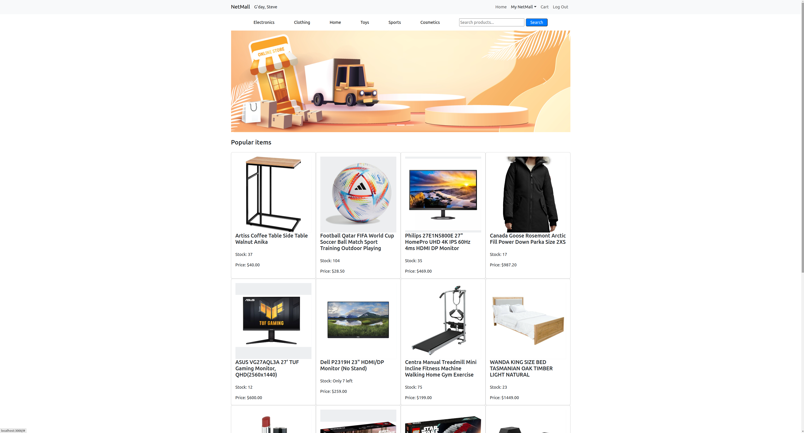
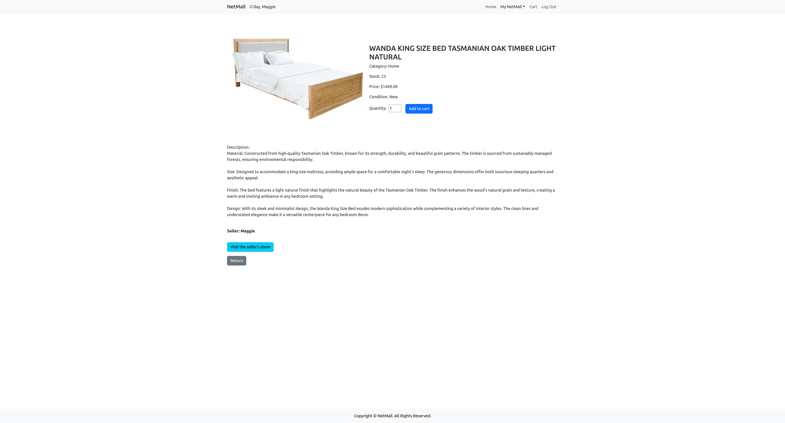
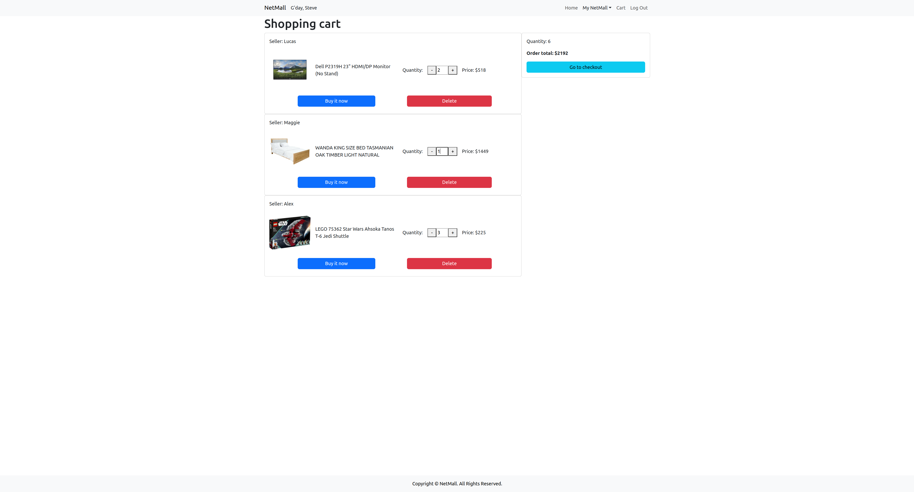

# NetMall

NetMall is a dynamic multi-vendor e-commerce platform where users can effortlessly buy or sell a diverse range of products. With its user-friendly interface and robust features, NetMall offers a seamless shopping experience for buyers while providing a lucrative platform for sellers to showcase and sell their products. 

Whether you're in search of unique items or looking to expand your market reach as a seller, NetMall offers a vibrant marketplace tailored to meet your needs.

## Screenshot

The home page

The product detail page

The store page

The cart page

The purchase history page

## Technologies Used

Django REST Framework, PostgreSql, Bootstrap were used in this app.

## Getting Started

Visit the app from https://net-mall-41b5566731fe.herokuapp.com/ or clone the app from https://github.com/jameszhao1021/NetMall.git.
1. Sign up for a new account using your email. Click the verification link in the email you receive to verify your email address. After verification, you can log in to your account.
2. You can see all products on the home page, and click to see details page, where you can add the product to your cart.
3. Click on the cart in the navigation bar to check out. You need to provide delivery information. Once payment is confirmed, you can see your orders in Purchase History page.
4. You can create, delete and edit products that you want to sell in your store. You are not able to buy products listed by youself. 
5. The password reset feature allows you to change your password anytime. You will receive a link in your email address by clicking "Reset Password",  
  
## Next Steps

I will consume payment API and allow users to do more customised settings in later versions. Furthermore, I will keep improving the appearance of each page. 